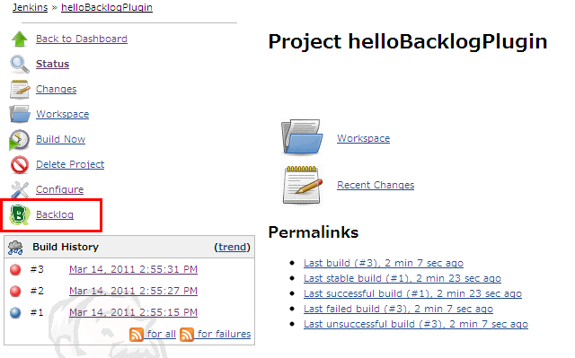
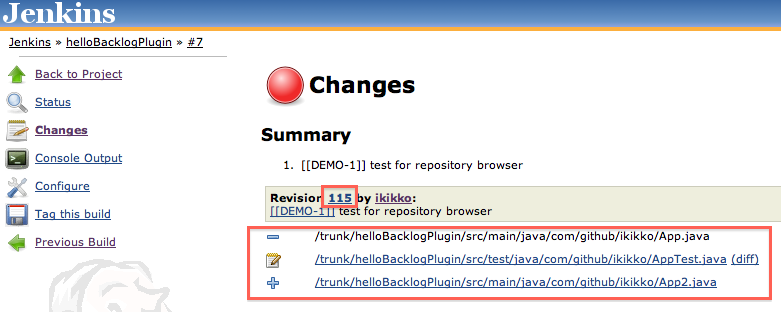
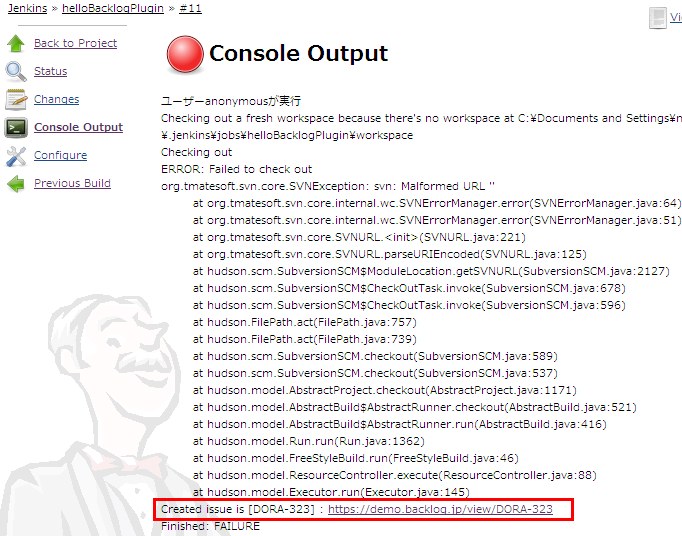
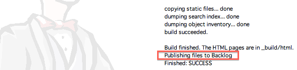
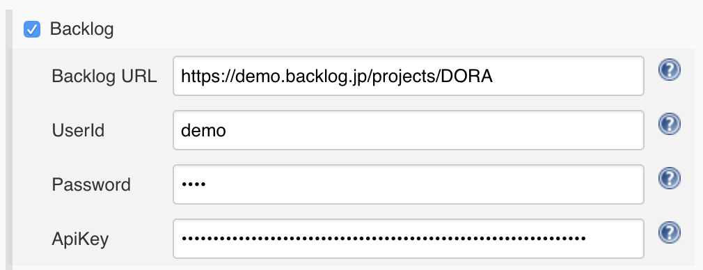
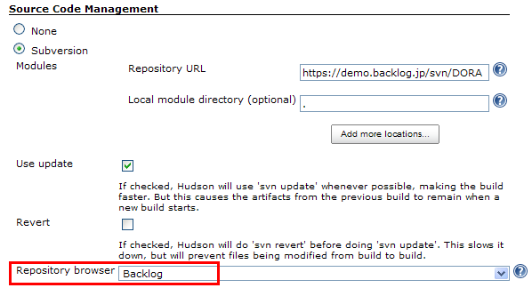
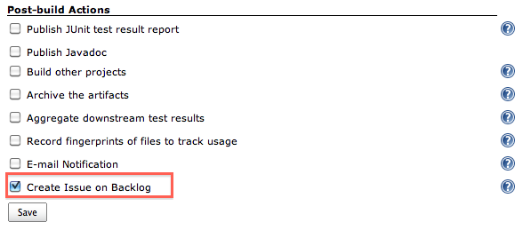
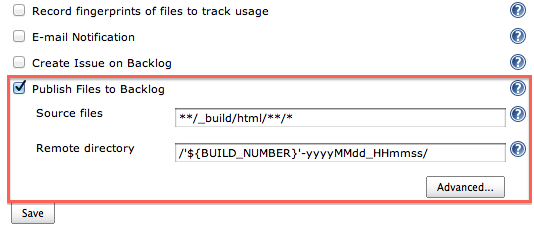
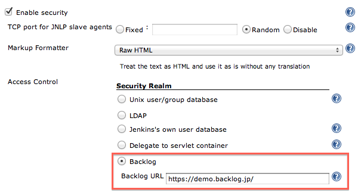
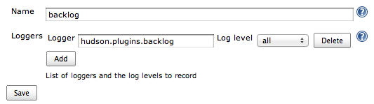

This plugin integrates Jenkins to Backlog.
[Backlog](https://backlog.com/) is an issue tracking system provided by [Nulab](http://nulab.com/).

------------------------------------------------------------------------

# Feature

## Link to Backlog space on navigation menu

This plugin adds a link to your Backlog Space or project to navigation
menu on left side of Job page.

## Convert issue notation to link for an issue

In the "Changes" section, this plugin converts issue notation of Backlog
(like BLG-123, shown in the following example) found in your commit
message to link for an issue on your Backlog space.

    Fixed Bug [[BLG-123]]
    Fixed Another Bug ( BLG-123 )

## Link to Backlog repository browser

This plugin adds changeset / diff links to "Summary" section on
"Changes" page. (now supporting Subversion and Git SCM)

## Create issue on Backlog

This plugin creates an issue on Backlog when build fails or becomes
unstable.

## Publish files to Backlog

This plugin publishes build artifacts to [Backlog
File](http://backlogtool.com/help/usersguide/file/userguide234/) which
is shared storage for Backlog users.

Refer to the following blog entries for more details.

-   For English readers, [How to transfer artifacts built on Jenkins to
    Backlog](https://nulab-inc.com/blog/backlog/transfer-jenkins-to-backlog/)
-   For Japanese readers,
    [Jenkinsで生成したファイルをBacklogのファイル共有に転送する](https://nulab-inc.com/ja/blog/backlog/jenkins-backlog/)

## Notify build result to Backlog pull request

This plugin notifies a build result to [Backlog pull
request](http://backlogtool.com/help/usersguide/git/userguide2609/).
Refer to the following blog entries.

-   For Japanese readers, [Jenkins Backlog
    Pluginで、ビルド結果をプルリクエストに通知！](https://nulab-inc.com/ja/blog/backlog/jenkins-to-pull-request/)

## Multibranch pipeline for Backlog pull request

This plugin support multibranch for Backlog pull request ( like [GitHub
Branch Source
Plugin](https://go.cloudbees.com/docs/cloudbees-documentation/cje-user-guide/index.html#github-branch-source)
). You can see each pipeline according to each pull request.

{width="500"}

Refer to the following blog entries for more details.

-   For Japanese readers, [Jenkins Backlog Plugin in Pipeline –
    自動でプルリクのジョブを作っちゃうんだ♪
    –](https://nulab-inc.com/ja/blog/backlog/jenkins-backlog-plugin-in-pipeline/)

## Add security realm by Backlog user

This plugin enables you to login to your Jenkins through authentication
by Backlog user.

------------------------------------------------------------------------

# Configuration

## Job configuration

1.  Navigate to the Configuration page for your job.
2.  In the top section, you can find setting for "Backlog".
    1.  "Backlog URL" : enter URL of your Backlog Space ( eg.
        [https://demo.backlogtool.com](https://demo.backlogtool.com/) or
        <https://demo.backlog.jp/> ) or Backlog project ( eg.
        <https://demo.backlogtool.com/projects/DORA> or
        <https://demo.backlog.jp/projects/DORA> ).
    2.  "User ID" / "Password / API key" : enter User ID, Password or
        API key. They are used to connect Backlog API in some features
        like creating an issue when build fails.  
        
3.  In "Source Code Management" section, check "Subversion" or "Git",
    and select "Backlog" in "Repository browser" field. When you select
    "Git", you have to enter repository name.  
      
    When you want to select other project, click "advanced..." button
    and enter URL of the project explicitly.
4.  In "Post-build Actions" section, check "Create Issue on Backlog".  
    
5.  In "Post-build Actions" section, check "Publish Files to Backlog".
    1.  "Source files" : enter build files to be published. You can use
        Ant glob syntax to specify files.
    2.  "Remote directory" : enter directory name on Backlog File to
        save artifacts. You can use environment variables defined in
        Jenkins here.  
          
        You can modify directory name to include timestamp by clicking
        "advanced..." option on this setting screen. For more details,
        refer the help available on that page.
6.  Save your changes.

## Global configuration

1.  Navigate to the Configuration page for your Jenkins.
2.  In the top section, you can find the setting for "Enable security".
    1.  In "Access Control" \> "Security Realm" section, select
        "Backlog".
    2.  "Backlog URL" : enter URL of your Backlog Space ( eg.
        <https://demo.backlogtool.com/> or <https://demo.backlog.jp/>
        ).  
        
3.  Save your changes.

------------------------------------------------------------------------

# Trouble Shooting

When you have an unexpected result, refer to log. Add
"hudson.plugins.backlog" logger, and you can see.

------------------------------------------------------------------------

# Release Notes

See the [Changelog](./CHANGELOG.md).